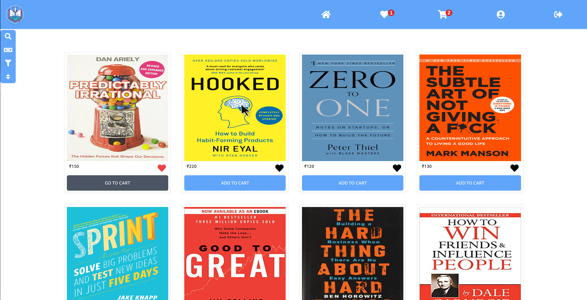

# Startup Reads
An E-commerce App built with React⚛

Deployed app: [https://startup-reads.netlify.app/](https://startup-reads.netlify.app/)    
    
Backend source code (Express & Mongoose): [https://startup-reads-backend.maddydev.repl.co](https://startup-reads-backend.maddydev.repl.co)

---
### Features:
1. Local storage persistence
2. Log in and Sign up
3. Search Params: Used for sort and filter, persistent
4. User actions like add/remove from cart, toggle wishlist
5. Product page for each product
6. Increment/decrement quantity in Cart page
7. Total price with quantity shown in the checkout section
8. Invoice Print
9. Payment Integration
10. React: useContext, useReducer, useEffect, useState, custom hooks, functional components

-----
### Libraries used: 
- **React.js** : v17.0.2
- **React router**: v6.0.0-beta.0
- **Axios** : v0.21.1
- **OK CSS library (developed by me)**: v1.0.0

Icons: Font Awesome [font icons](https://fontawesome.com/)   
Bootstrapped with `create-react-app`

---
#### Get started

1. **Clone the repo:**
```bash
  $ git clone https://github.com/Madhusudan707/startup-reads.git
```
2. **Switch to `development` branch:**
```bash
  $ cd startup-reads
  $ git checkout development
```
3. **Install required node modules:**
```bash
  $ npm install
```
4. **Start the dev server:**
```bash
  $ npm start
```
Open the `localhost` link in the browser.
Happy hacking!       

#### Product list page screenshot     



